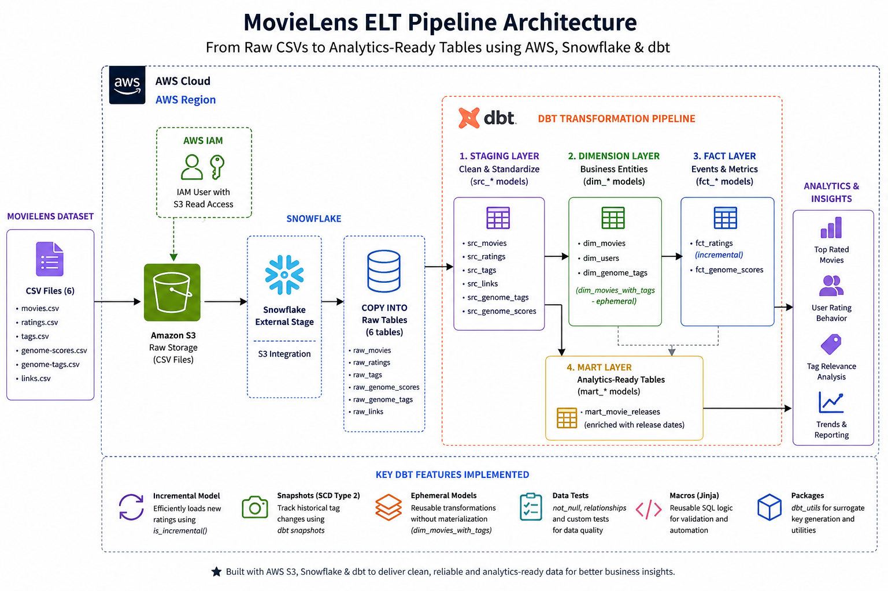
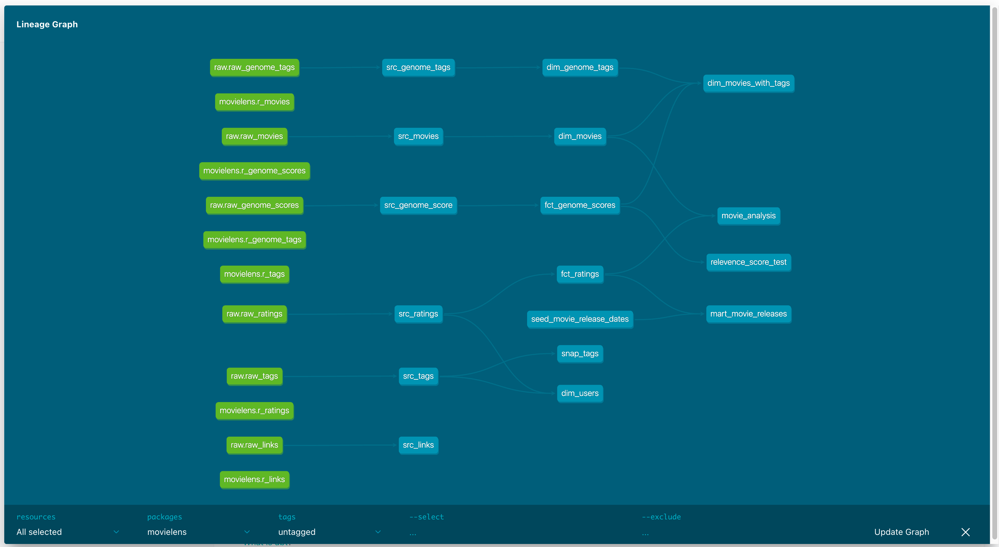

# 🎬 MovieLens ELT Pipeline (AWS + Snowflake + dbt)
 
An end-to-end data engineering project that builds a scalable ELT pipeline using the MovieLens 20M dataset, transforming raw user interaction data into analytics-ready models using AWS S3, Snowflake, and dbt.
 
---
 
## 🎯 Project Objective
 
To design and implement a modern cloud data pipeline that transforms raw movie ratings, tags, and metadata into structured analytical models for:
 
- Movie popularity analysis
- User rating behavior insights
- Tag relevance and evolution tracking
- Analytics-ready reporting datasets
---
 
## 🏗️ Architecture
 
```
MovieLens Dataset (CSV files)
        ↓
Amazon S3 (Raw Storage)
        ↓
Snowflake External Stage (S3 Integration)
        ↓
COPY INTO → Raw Tables
        ↓
dbt Staging Layer (Cleaning & Standardization)
        ↓
dbt Dimension & Fact Models (Business Logic)
        ↓
dbt Mart Layer (Analytics-ready tables)
```
 
---
 
## 🛠️ Tech Stack
 
| Layer | Technology | Purpose |
|---|---|---|
| Storage | Amazon S3 | Raw dataset storage |
| Security | AWS IAM | Secure Snowflake access |
| Warehouse | Snowflake | Scalable cloud data warehouse |
| Transform | dbt Core | SQL-based transformation framework |
| Utilities | dbt_utils | Macros & surrogate keys |
| Language | SQL + Jinja | Data modeling logic |
 
---
 
## ☁️ Infrastructure Setup
 
All Snowflake setup SQL (user creation, IAM integration, external stage, raw table loading) is available in [`setup/snowflake_setup.sql`](setup/snowflake_setup.sql).
 
This covers:
- Snowflake role, warehouse, and user creation
- AWS IAM user with least-privilege S3 access
- External stage connecting Snowflake to S3
- COPY INTO commands for all 6 raw tables
---
 
## 📁 dbt Project Structure
 
```
movielens/
├── models/
│   ├── staging/   → Raw data cleaning (src_ models)
│   ├── dim/       → Dimension tables
│   ├── fct/       → Fact tables (events & metrics)
│   └── mart/      → Final reporting layer
├── snapshots/     → SCD Type 2 historical tracking
├── seeds/         → Static reference CSV data
├── macros/        → Reusable Jinja SQL logic
├── tests/         → Custom data quality tests
├── analyses/      → Ad-hoc exploration queries
├── setup/         → Snowflake infrastructure setup SQL
├── packages.yml   → dbt_utils dependency
└── dbt_project.yml → Project configuration
```
 
---
 
## 🧩 Data Models
 
## 📊 DBT Lineage Graph


### 🔹 Staging Layer
Cleaned and standardized raw data:
 
| Model | Description |
|---|---|
| `src_movies` | Raw movies with renamed columns |
| `src_ratings` | Raw ratings with timestamp conversion |
| `src_tags` | Raw tags with timestamp conversion |
| `src_links` | Movie external links (IMDB, TMDB) |
| `src_genome_tags` | Genome tag labels |
| `src_genome_scores` | Genome relevance scores |
 
### 🔹 Dimension Layer
Business entities:
 
| Model | Description |
|---|---|
| `dim_movies` | Movie metadata with genres array |
| `dim_users` | Unique users extracted from activity |
| `dim_genome_tags` | Standardized tag definitions |
 
### 🔹 Fact Layer
Event-based analytical tables:
 
| Model | Description |
|---|---|
| `fct_ratings` | User movie ratings (incremental model) |
| `fct_genome_scores` | Tag relevance scores per movie |
 
### 🔹 Mart Layer
Final analytics datasets:
 
| Model | Description |
|---|---|
| `mart_movie_releases` | Ratings enriched with release metadata |
 
---
 
## ⚡ Key dbt Features Implemented
 
- 🔄 **Incremental Model** → Efficient loading of new ratings only
- 📸 **Snapshots (SCD Type 2)** → Track historical tag changes
- 🧩 **Ephemeral Models** → Optimized transformations without storage cost
- 🧪 **Data Testing** → Not null, relationships, and custom tests
- 🧠 **Macros (Jinja)** → Reusable SQL logic for data validation
- 📦 **dbt Packages** → Surrogate key generation using dbt_utils
---
 
## 📊 Analytical Outputs
 
This pipeline enables:
 
- Top-rated movies based on user ratings
- Most active users in the platform
- Genre-wise rating distribution
- Tag relevance across movies (genome data)
- Historical tag evolution tracking (SCD2 snapshots)
---
 
## ⚠️ Key Engineering Highlights
 
- Designed multi-layer ELT architecture (staging → mart)
- Implemented incremental processing for 20M+ ratings dataset
- Built slowly changing dimension tracking using dbt snapshots
- Applied data modeling best practices (Kimball approach)
- Ensured data quality through automated dbt tests
---
 
## 🚀 How to Run
 
### Prerequisites
- Python 3.8+
- dbt-snowflake installed
- Snowflake account
- AWS account with S3 bucket and IAM user
### Setup
 
```bash
# Clone the repo
git clone https://github.com/itsmeshambhus/movielens-elt-pipeline.git
cd movielens-elt-pipeline
 
# Run Snowflake infrastructure setup
# See setup/snowflake_setup.sql
 
# Install dbt packages
dbt deps
 
# Run the full pipeline
dbt build
```
 
### Common Commands
 
```bash
dbt run                              # Run all models
dbt test                             # Run all tests
dbt build                            # Run models + tests
dbt seed                             # Load seed files
dbt snapshot                         # Run snapshots
dbt docs generate && dbt docs serve  # View documentation
```
 
---
 
## 📚 Dataset
 
**MovieLens 20M** — a well-known dataset from GroupLens Research:
 
- 20M+ ratings
- 27,000+ movies
- 138,000+ users
- Genome tag relevance scores
---
 
## 🧠 What I Learned
 
- Building cloud ELT pipelines using AWS + Snowflake
- Designing modular data models with dbt
- Implementing incremental and snapshot strategies
- Writing reusable SQL using Jinja macros
- Applying production-style data engineering practices
---
 
## 📬 Connect

Built by **Shambhu Prasad Sah** — [LinkedIn](https://www.linkedin.com/in/sahshambhu/) · [GitHub](https://github.com/itsmeshambhus)